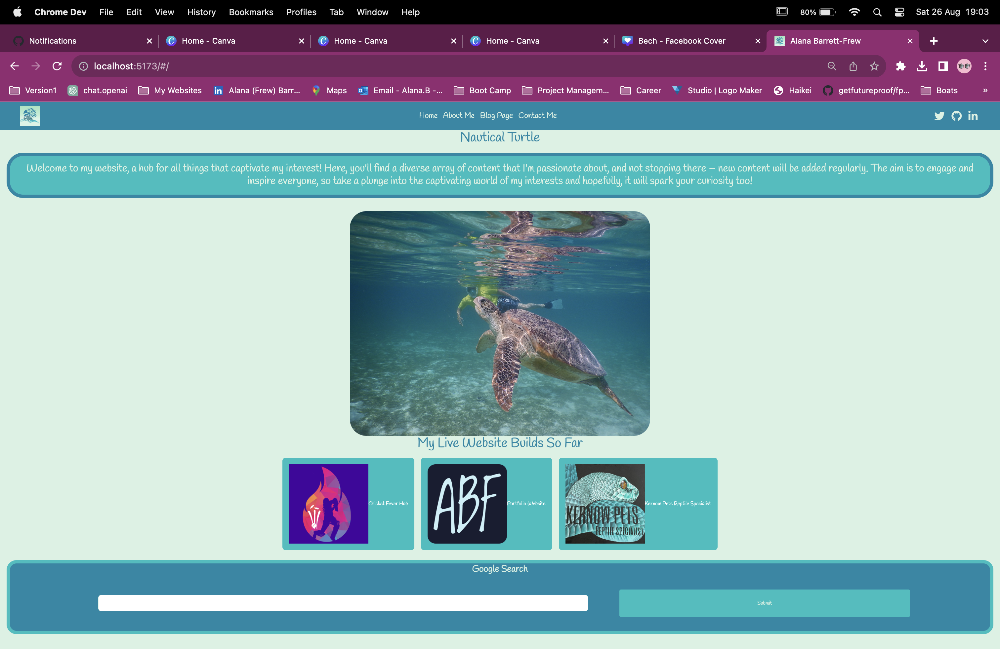
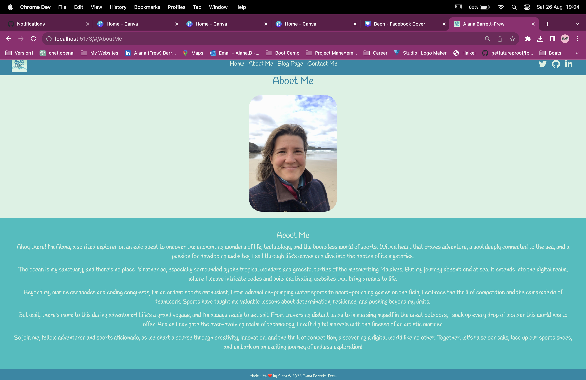
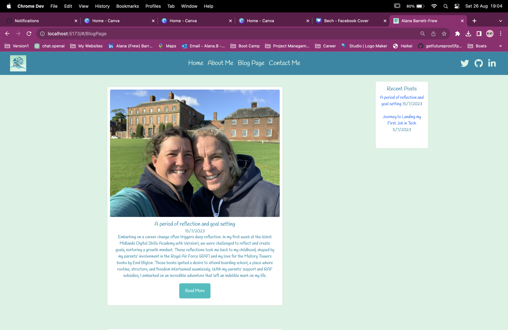
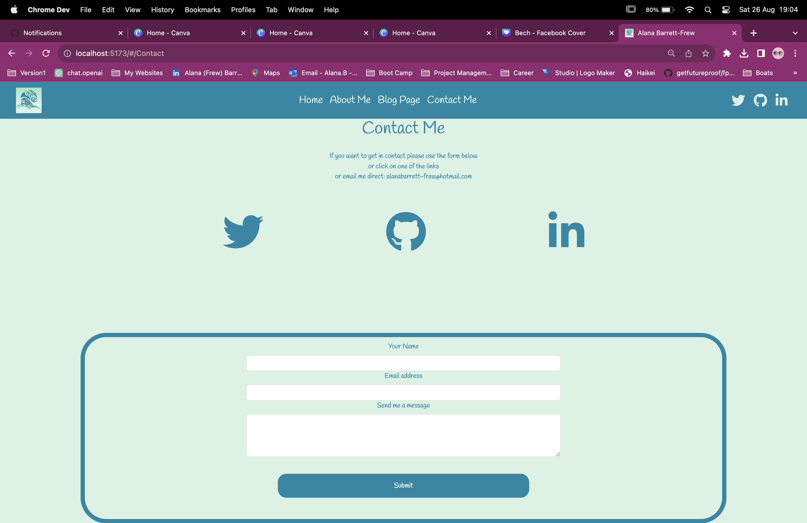

# Nautical Turtle

## Table of Contents

- [Nautical Turtle](#nautical-turtle)
  - [Table of Contents](#table-of-contents)
  - [Technology Used](#technology-used)
  - [Description](#description)
  - [Usage](#usage)
  - [Screenshots](#screenshots)
  - [Contributing](#contributing)
  - [License](#license)
  - [Questions](#questions)

## Technology Used

Portfolio built on

using

Technologies, frameworks and libraries used include:

## Description

A website to showcase me and my interests.

Deployed Site: <https://www.nauticalturtle.com>  

## Usage

You can use this application to find out more about me and share some of my interests.

## Screenshots

## Contributing

Alana Barrett-Frew
Emailjs.com to create a form and send me an email direct.

## License

*This project is licensed under* [MIT](https://choosealicense.com/licenses/mit/)

## Questions

*Contact me if you have any questions or need to report a problem. Alternatively open an issue.*

Find me on GitHub: [AlanaBF](https://github.com/AlanaBF)

Email: [alanabarrettfrew@gmail.com](mailto:alanabarrettfrew@gmail.com)
